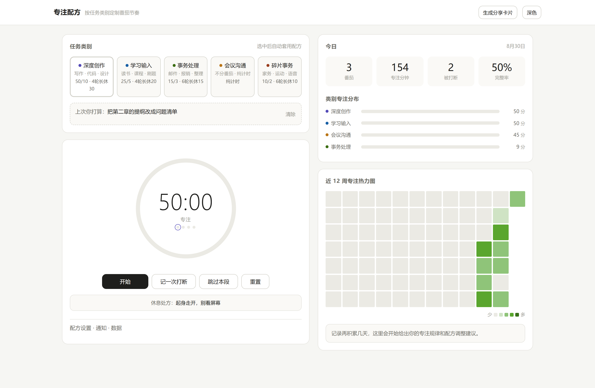
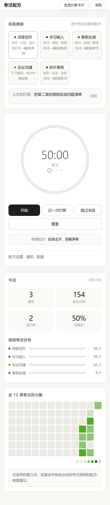
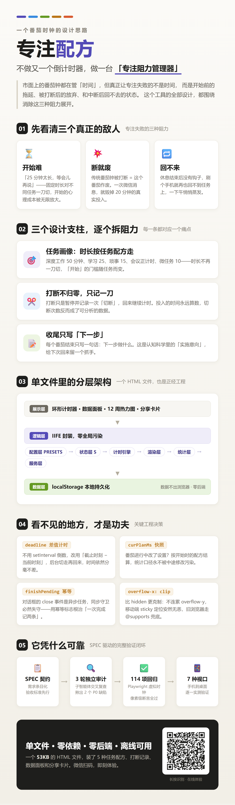

# 专注配方 · Focus Recipe

> 不做第 1001 个倒计时器，做一台「专注阻力管理器」。

一个**单文件 HTML** 番茄时钟：53KB、零依赖、零后端、离线可用，数据只存在你自己的浏览器里。

- 🌐 在线体验：https://8f84cc8a29094870b7c293a19839b873.app.workbuddy.link
- 📄 产品规格（契约驱动的唯一权威依据）：[docs/SPEC.md](docs/SPEC.md)

## 为什么又做一个番茄钟？

市面上的番茄钟都在管「时间」，但真正让专注失败的不是时间：

| 阻力 | 表现 | 本工具的解法 |
|---|---|---|
| ⏳ 开始难 | 「25 分钟太长，等会儿再说」 | **任务画像**：深度 50′ / 学习 25′ / 琐事 15′ / 会议正计时 / 微任务 10′，时长随任务而变 |
| 💥 断就废 | 一次打断 = 整个番茄作废 | **打断不归零，只记一刀**：暂停记录一次「切断」，回来继续，投入永远算数 |
| 🔁 回不来 | 休息完刷手机，一下午蒸发 | **收尾只写「下一步」**：一句话的实施意向，给下次回来留抓手 |

## 功能一览

- 🎯 5 种任务配方（时长 / 短休 / 长休 / 长休节奏，全部可自定义）
- ✂️ 打断记录：切断次数成为可分析的数据，而非惩罚
- 📝 完成收尾：写一句「下一步」，下次启动直接看到
- 📊 数据面板：KPI、分类分布、12 周热力图、洞察与时长建议
- 🖼 分享卡片：一键生成 PNG 战绩卡
- 📱 手机 / 桌面自适应，支持通知提醒与离线使用

## 工程要点

一个 HTML 文件，也是正经工程：

- **deadline 差值计时**：不用 `setInterval` 倒数，后台切走再回来分毫不差
- **curPlanMs 快照**：番茄进行中改设置，按开始时的配方结算，统计口径不被污染
- **finishPending 幂等**：根治 `<dialog>` 异步 close 事件导致的「一次完成记两条」
- **分层架构**：配置层 PRESETS → 状态层 → 计时引擎 → 渲染层 → 统计层 → 服务层，IIFE 封装零全局污染
- **品质验证**：SPEC 契约 → 3 轮子智能体独立审计（揪出 2 个 P0）→ 114 项 Playwright 回归（虚拟时钟 + 像素级断言）→ 7 种视口实测，详见 [docs/SPEC.md](docs/SPEC.md) §7

## 本地使用

下载 `index.html`，双击打开即可。无需安装、无需联网、无需账号。

## License

[MIT](LICENSE) — 随意使用、修改、分发，保留版权声明即可。
